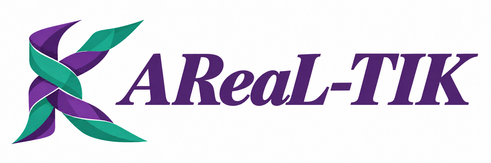
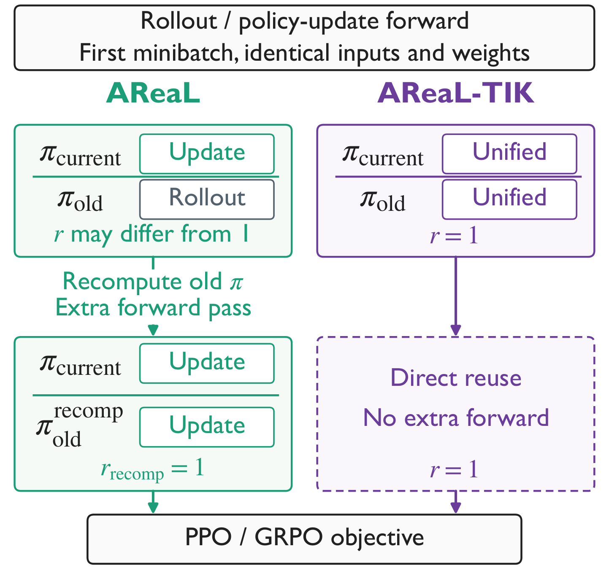
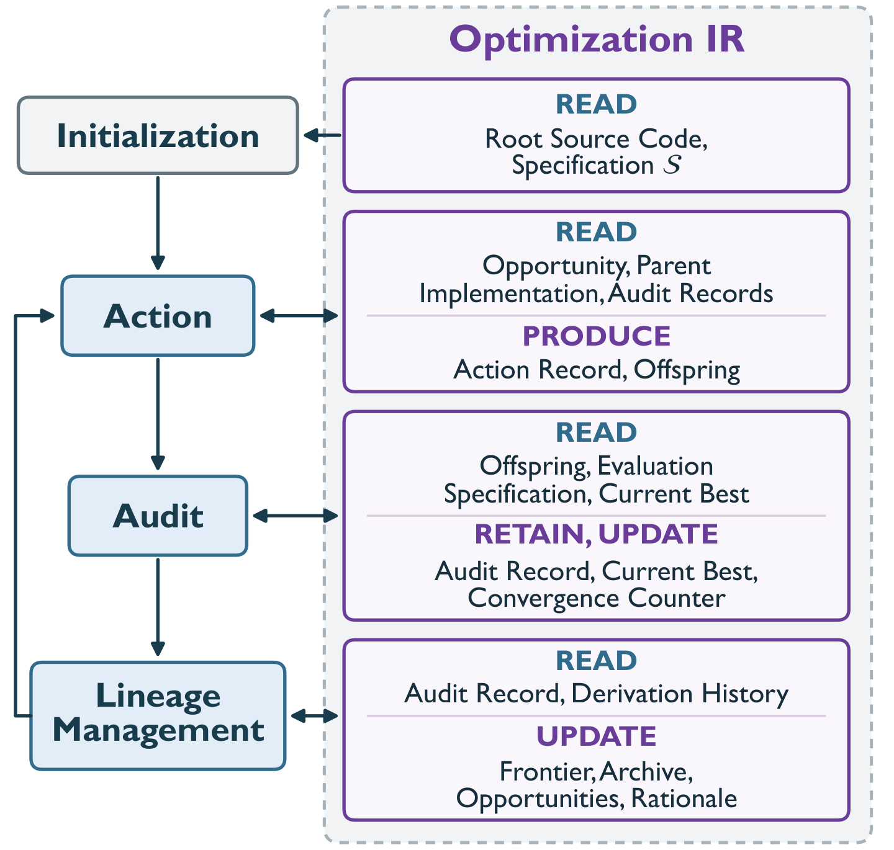
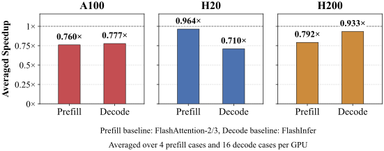

<div align="center">

<h1>
  
</h1>

**Stateful Agentic Optimization of Unified RL Kernels through an Optimization IR**

[Background](#background) · [Method](#method) · [Installation](#installation) · [Usage](#usage) · [Performance](#performance)

</div>

---

**AReaL-TIK** develops bitwise-aligned kernels for RL post-training, with the goal
of reusing rollout log-probabilities during policy updates and removing the extra
forward pass used to recompute them. Its agentic optimization framework searches
for efficient rollout and policy-update implementations under a shared numerical
contract.

This repository provides the **prompt-driven optimization skill** and resulting
**unified attention kernels** for **NVIDIA H20, H200, and A100**. Each GPU's
`config.yaml` defines the agent roles, numerical contract, evaluation workloads,
and search limits, alongside the selected kernels and their recorded evidence.

- [Background](#background)
- [News](#news)
- [Method](#method)
- [Advantages](#advantages)
- [Features](#features)
- [Agent Harness](#agent-harness)
- [Installation](#installation)
- [Usage](#usage)
- [Evaluation](#evaluation)
- [Performance](#performance)
- [Repository Structure](#repository-structure)
- [Acknowledgments](#acknowledgments)

## Background

PPO and GRPO compare current-policy token probabilities with those recorded during
rollout. With identical inputs and weights, their ratio should be one, but different
rollout and policy-update kernels can introduce numerical disagreement.

Systems address this by recomputing old-policy log-probabilities with the training
backend, adding an extra forward pass. **Bitwise-aligned prefill and decode** enable
direct reuse of rollout values when alignment holds across the full model. This
release provides the attention kernels; current-policy training forward and
backward still run.

<p align="center">
  <a href="assets/ppo_grpo_ratio_workflow.pdf"></a>
</p>

## News

- **[2026-09]** Organized the selected H20, H200, and A100 attention implementations
  with per-GPU configs, correctness-qualified snapshots, and experimental versions.

## Method

AReaL-TIK searches for efficient implementations while enforcing numerical
constraints between their entrypoints. An **optimization intermediate
representation (IR)** retains source versions, correctness checks, performance
measurements, optimization opportunities, and branch histories. The agent uses
this evidence to propose changes, evaluate candidates, and retain useful branches.

<p align="center">
  <a href="assets/optimization_ir_system_view.pdf"></a>
</p>

*Framework overview from the accompanying manuscript. The attention harness
materializes these four roles through the prompts in each GPU's `config.yaml`.
Full-model RL integration is outside this attention release.*

For attention, the numerical contract connects full-sequence prefill, partitioned
forward execution, and one-token decode. GPU-specific tiling, data movement,
parallelism, and dispatch are optimized within that contract.

## Advantages

- **Bitwise-aligned prefill and decode.** Prefill and incremental decode produce
  bitwise-identical attention outputs for the same inputs and context across the
  supported workloads.
- **Performance comparable to FlashAttention-3 and FlashInfer.** Prefill reaches
  **0.79–0.96× FlashAttention-3** performance on H20/H200, while decode reaches
  **0.71–0.93× FlashInfer** performance across the three GPUs, preserving bitwise
  alignment between the unified execution paths. A100 prefill uses FlashAttention-2
  as its baseline; see the [measured comparisons](#performance).

## Features

The selected attention implementations have recorded coverage for:

- NVIDIA H20/H200 (`sm90a`) and A100 (`sm80`).
- BF16, causal attention, contiguous `[batch, heads, sequence, head_dim]` inputs.
- 32 query heads, 8 KV heads, and head dimension 128.
- Prefill lengths 1K / 4K / 8K / 16K and decode contexts 128 / 1K / 4K / 8K.
- Batch sizes 1 / 4 / 8 / 16, with one query token per decode call.

This release covers forward attention; see [Evaluation](#evaluation) for the
recorded correctness coverage.

## Agent Harness

The [AReaL-TIK skill](.agents/skills/areal-tik/SKILL.md) runs in your existing
coding agent. Its workflow is defined by the prompts in [H20](experimental/h20/config.yaml),
[H200](experimental/h200/config.yaml), and [A100](experimental/a100/config.yaml):

| Prompt | Role |
| --- | --- |
| `agent_task` | Shared research, implementation, numerical, and logging instructions |
| `initialization` | Verify the root, freeze the evaluation contract, and derive initial opportunities |
| `action` | Select an opportunity and verified parents; produce a complete candidate |
| `audit` | Independently verify and measure the candidate; update the best implementation |
| `lineage_management` | Continue, merge, archive, or abandon branches using retained evidence |
| `agent_task_epoch` | Execute the four-stage protocol in a persistent coding-agent session |

The agent follows these prompts, maintains the optimization IR as JSON records,
and calls the independent CUDA evaluator. The records link source versions,
parents, measurements, and follow-up opportunities. Verified non-best versions
remain available for exploration; failed candidates cannot become parents.

Use your agent's existing model and authentication. AReaL-TIK requires no
separate model API key. The per-GPU configs define the numerical contract,
weighted latency objective, and search limits.

## Installation

Use Linux with the target NVIDIA GPU, a CUDA toolkit containing `nvcc`, a
compatible C++ compiler, and CUDA-enabled PyTorch. Evaluation uses:

| GPU | Prefill baseline | Decode baseline | Kernel headers |
| --- | --- | --- | --- |
| H20 / H200 | FlashAttention-3 | FlashInfer (FA2 / FA3 backends) | CUTLASS/CuTe |
| A100 | FlashAttention-2 | FlashInfer (FA2 backend) | CUDA toolkit |

After installing the appropriate PyTorch/CUDA stack, install the loader utilities:

```sh
python -m pip install PyYAML ninja
```

For Hopper, point the loader to your CUTLASS/CuTe headers:

```sh
export CUTLASS_INCLUDE_DIR=/path/to/cutlass/include
python tools/load_kernel.py --gpu h200
```

Use `--gpu h20` on H20. On A100, the selected source builds without CUTLASS:

```sh
python tools/load_kernel.py --gpu a100
```

The loader verifies the source hash and target GPU before compiling.
FlashAttention and FlashInfer are used for benchmark comparisons; they are not
required to load the unified extension itself.

## Usage

### Start an optimization run

Open this repository in Codex and invoke the skill:

```text
$areal-tik Optimize H200 attention in a new run under runs/h200-trial.
```

Use H20 or A100 for the corresponding GPU. Codex discovers the repository's
`.agents/skills/` directory; see [skill discovery](https://learn.chatgpt.com/docs/build-skills#where-codex-loads-local-skills).
With another coding agent, ask it to read
[SKILL.md](.agents/skills/areal-tik/SKILL.md) and follow the chosen GPU config.

The agent prepares an isolated run, verifies the starting kernel on the target
GPU, then follows the Action, Audit, and Lineage Management prompts. New sources,
measurements, search records, and the best verified kernel are saved in the run
directory. GPU access and the dependencies in [Installation](#installation) are
required for evaluation.

### Use a selected kernel

Run from the repository root on the corresponding GPU:

```python
import torch
from tools.load_kernel import load_kernel

kernel = load_kernel("h200")  # "h20" or "a100" on those GPUs
torch.manual_seed(17)

B, S, H_Q, H_KV, D = 1, 1024, 32, 8, 128
q = torch.randn(B, H_Q, S, D, device="cuda", dtype=torch.bfloat16)
k = torch.randn(B, H_KV, S, D, device="cuda", dtype=torch.bfloat16)
v = torch.randn_like(k)

# Causal full-sequence forward.
prefill = kernel.unified_prefill(q, k, v, H_Q, H_KV)

# One-token decode over the same KV context.
decode = kernel.unified_decode(q[:, :, -1:].contiguous(), k, v, H_Q, H_KV)

# Check raw BF16 bits for this example's final token.
assert torch.equal(
    prefill[:, :, -1:].contiguous().view(torch.int16),
    decode.contiguous().view(torch.int16),
)
```

The output has the same shape as the query. This example checks one case;
the archived suites cover additional batches, contexts, and prompt/answer splits.
The loader exposes a checked, forward-only interface; inputs must share the device
on which it was loaded. See [interface details](experimental/README.md#kernel-interface).

## Evaluation

Run bitwise checks and performance benchmarks on the target GPU:

```sh
python tools/evaluate.py --gpu h200 --output runs/h200-evaluation.json
```

Use `--gpu h20` or `--gpu a100` for the other GPUs. The
[evaluator](tools/evaluate.py) checks bitwise alignment, compares against
FlashAttention and FlashInfer, and saves correctness and timing results to JSON.
See [experimental details](experimental/README.md) for validation coverage,
benchmark methodology, and evaluator status.

## Performance

Attention performance on the manuscript's workloads, reported as averaged
**baseline latency / AReaL-TIK latency**; above 1 means faster.



Each prefill bar averages 4 configurations: batch 1 with sequence lengths
1K, 4K, 8K, and 16K. Each decode bar averages 16 configurations: batches
1, 4, 8, and 16 combined with context lengths 128, 1K, 4K, and 8K.
That is 20 configurations per GPU, or 60 across the three GPUs.

On these measured workloads, the unified attention kernels are slower than the
external baselines. These operator timings do not measure the benefit of
eliminating an old-policy forward pass from a complete RL training iteration.

See the [CSV data](experimental/figures/attention_performance.csv) and
[60 individual measurements](experimental/figures/attention_performance_cells.csv).
The [archive verifier](tools/verify_archive.py) reproduces all six bars from their
original measurement records.

## Repository Structure

```text
AReaL-TIK/
├── README.md
├── .agents/skills/areal-tik/
│   └── SKILL.md               # Agent entry point and optimization record format
├── assets/                    # Logo, figures, and their PDF versions
├── tests/                     # CPU evaluator and result-handling checks
├── tools/                     # Build, evaluation, and archive verification
└── experimental/
    ├── README.md              # Validation and benchmark details
    ├── archive.json           # GPU selections and snapshot counts
    ├── evidence/              # Original measurement/check records and hash index
    ├── figures/               # Plot data and provenance
    ├── a100/                  # Config, kernels, and saved validation
    ├── h20/
    └── h200/
```

## Acknowledgments

The implementations use PyTorch's C++/CUDA extension interface and, on Hopper,
CUTLASS/CuTe. FlashAttention and FlashInfer provide the external attention
baselines. We thank the maintainers of these projects for their open-source work.

We also acknowledge OpenAI's **GPT-6 Astra** for its assistance with kernel
optimization and repository development.

## License

AReaL-TIK is released under the [Apache License 2.0](LICENSE).
